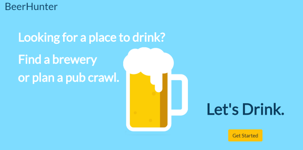
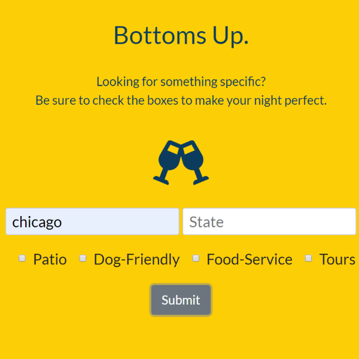
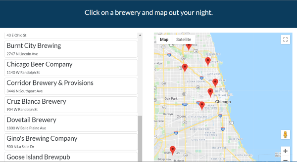

# BeerHunter

Git Hoppy Git Happy

A search engine for local breweries.

## Motivation

Connecting users with brew pubs in their area, whether traveling or local.

## Build status

Curently deployed: https://beerhunter.pub/

## Code style

JavaScript, CSS & HTML

## Screenshots

Landing:



Search Parameter Options:



Results Page:



## Tech/framework used

<b>Built with</b>

- [jQUERY](https://jquery.com/)

## Features

Custom pins to map pub crawl.

Ex. -

Public Script:

```
  $(document).on("click", ".cardResults", function() {
    var place = $(this).attr("data-name");
    var street = $(this).attr("data-street");

    var icon = {
      url: "./smbottle.png", // url
      scaledSize: new google.maps.Size(12, 34), // scaled size
      origin: new google.maps.Point(0, 0), // origin
      anchor: new google.maps.Point(0, 0) // anchor
    };
```

## Installation

Clone this repo and open in default browser.

## API Reference

- [Open Brewery DB](https://www.openbrewerydb.org/)
- [Google Maps API](https://developers.google.com/maps/documentation)

## Issues

State parameter needs to accept abbreviations

Storing custom pins to database or local storage

Only 10 pins are dropped on results page. Would like all results to be displayed on map.

## Contribute

Pull requests are welcome. For major changes, please open an issue first to discuss what you would like to change.

Please make sure to update tests as appropriate.

## Credits

- [Katie](https://github.com/KatieMcbride)
- [Hannah](https://github.com/hchamorro)
- [Sanela](https://github.com/bogdana07)

## License

MIT
